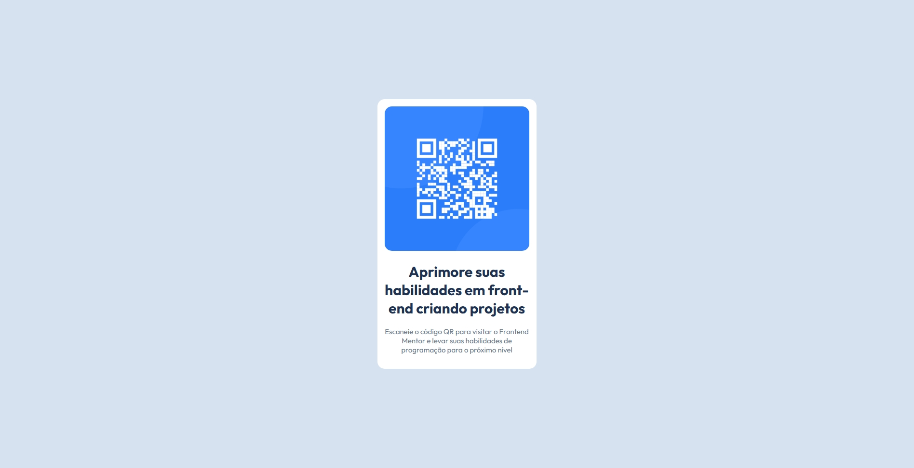
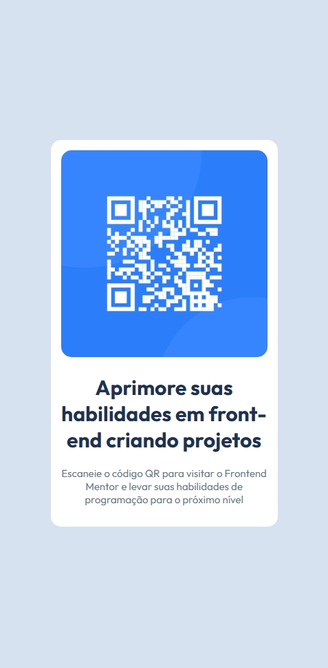

# QR Code Component

Este é um projeto do desafio **QR Code Component** do [Frontend Mentor](https://www.frontendmentor.io), desenvolvido com o objetivo de praticar **HTML5 e CSS3**, focando em estrutura semântica, centralização de layout e responsividade.

> 🔎 **Observação:** Tomei a liberdade de **traduzir o conteúdo do desafio para o meu idioma (português)**, mantendo a proposta visual e funcional original.

---

## 📸 Preview

- desing original do projeto

## Meu resultado

 

obs: meu pc não emula tão bem a tela de um smartphone mas você consegue visualizar bem no smarphone, fiz os testes :)

---

## Tecnologias utilizadas

- HTML5
- CSS3
- Flexbox
- Google Fonts (Outfit)
- Variáveis CSS

---

## O que eu pratiquei neste projeto

- Estruturação semântica com HTML
- Centralização de componentes com Flexbox
- Uso de variáveis CSS para cores e fontes
- Responsividade básica
- Organização de código e boas práticas

